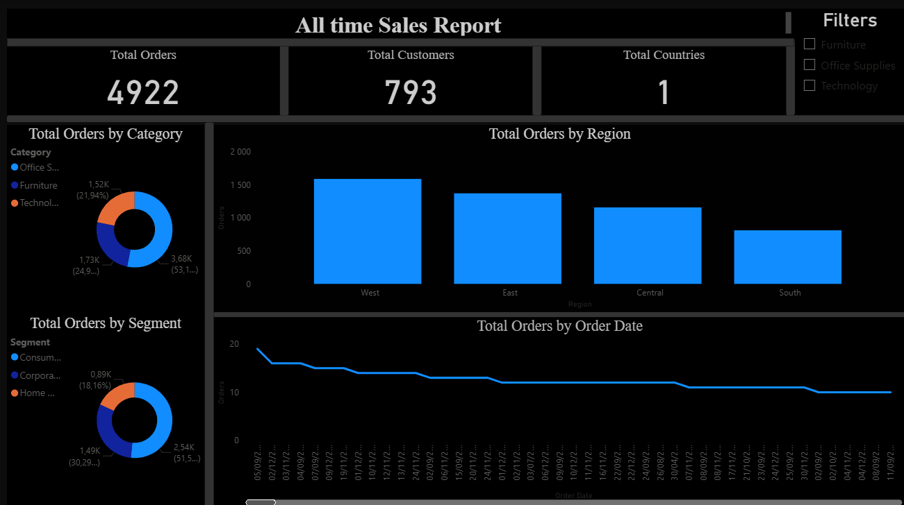

# Sales Analysis PowerBI
This project was created as part of my journey learning PowerBI. After learning, I decided to create a simple report/dashboard, putting my skills to test

## Introduction
🕯️🕯️Bridging Software Development and Data Science: My Learning Journey 🚀
  
Continuous learning is the cornerstone of any technical career. At the start of this week, I set out to refine my dual-track skillset—balancing Software Engineering with Data Science.
I am excited to share that I have successfully completed a comprehensive Power BI course by @Baraa. This experience has been pivotal in enhancing my data visualisation and business intelligence capabilities.

💡 Key Technical Takeaways:
1. Power Query: Mastering data ingestion and ETL processes (Extract, Transform, Load) to ensure data integrity.
2. DAX (Data Analysis Expressions): Utilizing advanced formulas to create dynamic calculated fields and measures.
3. Data Modelling: Leveraging the "Model View" to establish complex relationships between datasets.
4. Intuitive Visualisation: Using drag-and-drop capabilities to transform raw data into actionable insights.
5. End-to-End Workflow: Navigating the "Table View" for data exploration and the "Get Data" function for seamless integration.

🛠️ From Theory to Practice.
To solidify these concepts, I developed a Sales Report and published it to the Power BI Service. This project allowed me to test my ability to turn complex data into a functional, user-friendly dashboard.

🗺️ The Roadmap Ahead:
The journey doesn’t stop here. My goal is to remain proficient at the intersection of Application Development and Machine Learning. My next steps include:
1. Machine Learning: Completing an "Intro to ML" project on Kaggle to strengthen my predictive modelling skills. 🤖
2. Mobile & Web Development: Advancing my React.js knowledge while expanding into React Native for cross-platform mobile solutions. 📱
3. Data Science Fundamentals: Finalizing my Python Certification via freeCodeCamp to ensure backend and data script efficiency. 🐍
4. Advanced Analytics: Further refining my expertise in Tableau and Power BI for high-level storytelling. 📊

## Project Status
    COMPLETE

## Contact

I welcome connections and conversations regarding opportunities, collaborations, or shared interests in technology and data. Please feel free to reach out through any of the following channels:

*          
*  **Phone:** +27 714 366 053

